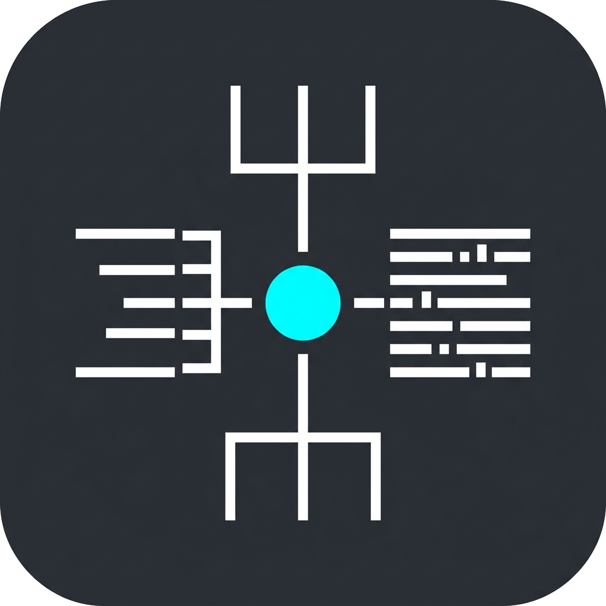

<div align="center">
  
  <br>
  <p><strong>DotVis</strong></p>

  
  
  
  
  <br>
  
  
</div>

---

## 対応している拡張子
- .json
- .toml
- .yaml
- .yml
- .ini
- .cfg
- .conf

## 動作環境
- Windows 11 64bit
- Python 3.13   

## ビルド方法
`build.bat` を実行してください。Nuitkaを使用してスタンドアロンの実行ファイルを作成します。
```batch
.\build.bat
```

## 実行方法
```bash
python main.py
```

## ライセンス
このソフトウェアはMITライセンスの下で公開されています。